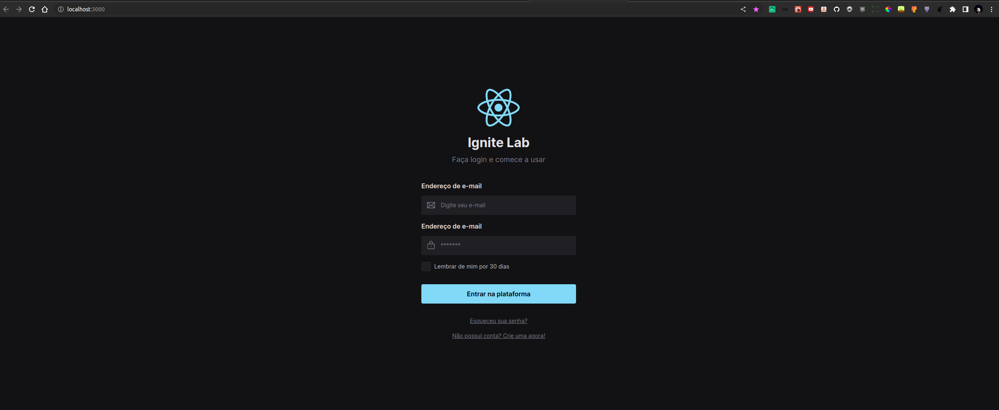

<h1 align='center'>
Design System
</h1>


<div align='center'>
  
</div>
</br>
</br>

<h1 align='center'>
Deploy do Storybook
</h1>


<div align='center'>
  
</div>
</br>
</br>

<h1 align='center'>
Tela da aplicação desenvolvida
</h1>


<div align='center'>
  
</div>
</br>
</br>

<h1 align='center'>
Deploy configurado do github actions
</h1>


<div align='center'>
  
</div>


 # 💻 Projeto
 
O projeto faz parte do IgniteLab, onde foi desenvolvida uma tela de login desde o desing system com o figma até o código junto também com os componentes no storybook e seu deploy contínuo.

 #  Até o momento foram usadas as seguintes tecnologias

- [ViteJS](https://vitejs.dev/);
- [ReactJS](https://pt-br.reactjs.org/);
- [Typescript](https://www.typescriptlang.org/);
- [TailWind](https://tailwindcss.com/);
- [Storybook](https://storybook.js.org/);
- [Clsx](https://www.npmjs.com/package/clsx);
- [Phosphor Icons](https://phosphoricons.com/);


## Para executar o projeto:

Clone o projeto e acesse a pasta IG-Lab-Design-System

```bash
$ git clone https://github.com/the-one-who-knoccks/IG-Lab-Design-System
$ cd IG-Lab-Design-System
```
Para iniciá-lo, siga os passos abaixo:
```bash
# Instalar as dependências
$ npm install

# Iniciar o projeto
$ npm run dev
```
A aplicação será iniciada no endereço http://localhost:3000.


